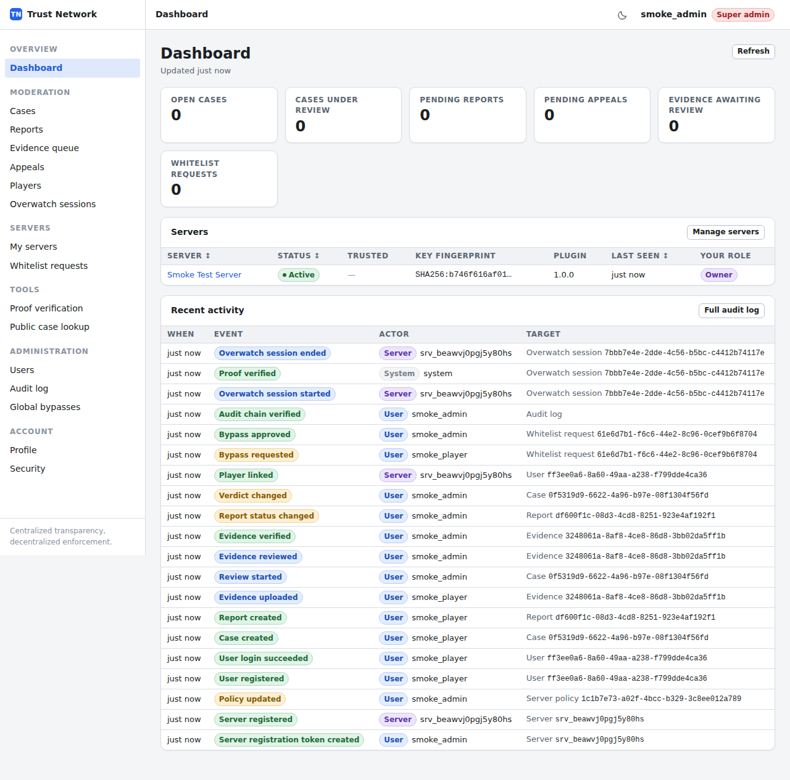
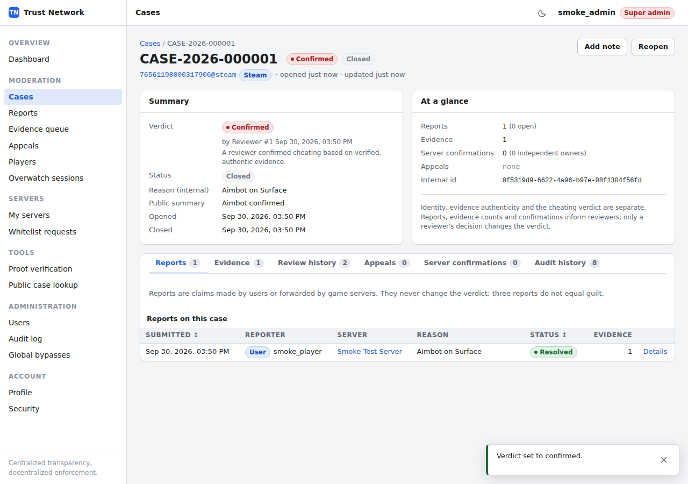
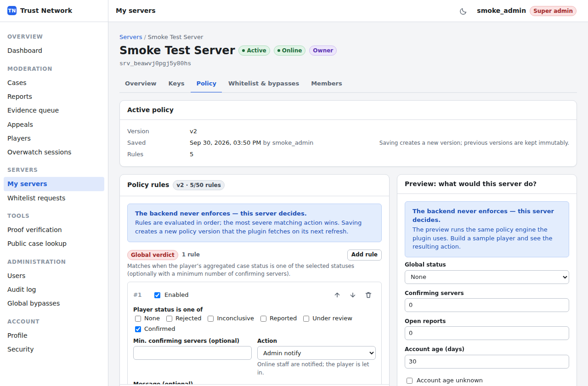
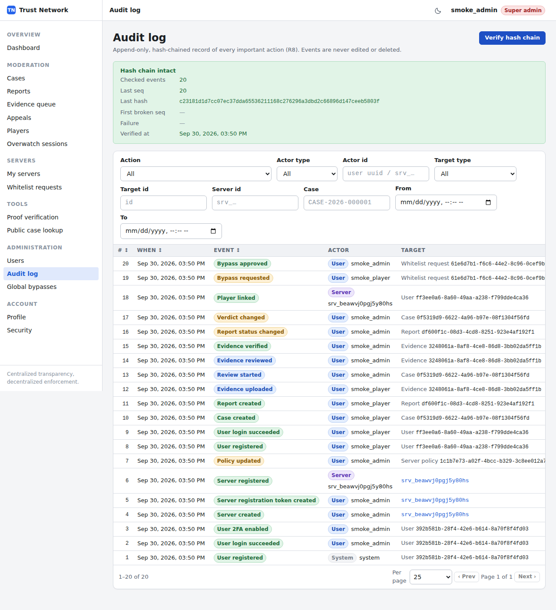
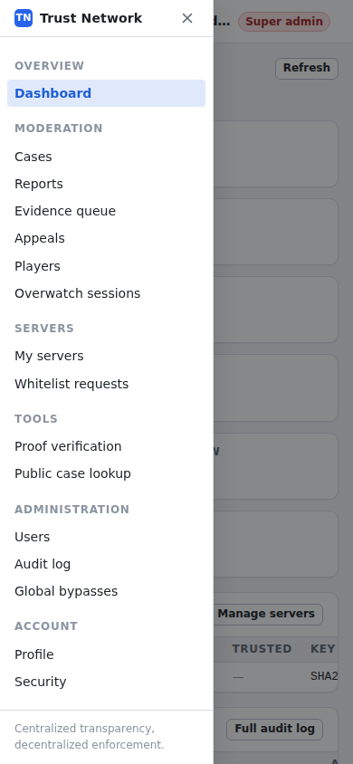

# SCP:SL Trust Network

A global anti-cheat, reporting, evidence and trust platform for **SCP: Secret Laboratory** servers:
a LabAPI server plugin (C#), a TypeScript backend (Fastify, PostgreSQL, Redis) and a React web
panel for players, server teams, reviewers and administrators.

**Status:** feature-complete, MIT-licensed, not yet released as a tagged version.
Verified: 2 606 automated tests (shared 833, backend 1189 incl. PostgreSQL/Redis integration,
web 115, plugin 469 — the C# plugin runs the same cross-language test vectors as the TypeScript
reference engine), a 12-step end-to-end API run and a 24-step browser walkthrough of the panel
(screenshots below), and the plugin loaded and exercised inside a real SCP:SL dedicated server.
Not verified in production: the Docker images are built in CI but not published or run at scale,
and there is no public deployment to point at.

### Compatibility

| Piece | Version | Source of truth |
|---|---|---|
| Plugin `ScpslTrust.Plugin` / `ScpslTrust.Core` | 1.0.x | `plugin/Directory.Build.props` |
| Backend API contract | `/api/v1` | [docs/API.md](docs/API.md) |
| `@scpsl-trust/shared` (schemas, vectors, policy engine) | 1.0.x | `shared/package.json` |
| SCP:SL dedicated server | 14.2.7 | verified run, [docs/PLUGIN.md](docs/PLUGIN.md) |
| LabAPI | 1.1.7 | plugin `RequiredApiVersion` |
| Plugin runtime | .NET Framework 4.8 (`net48`), Core `netstandard2.0` | plugin `.csproj` |
| Node.js / pnpm | 22 / 10.33 | root `package.json` |
| PostgreSQL / Redis | 16 / 7 | `docker-compose.yml`, CI |

A plugin and a backend are compatible when they share the major of `/api/v1` and the same
`@scpsl-trust/shared` major — the plugin is verified against the shared JSON test vectors on
every CI run. Exiled is not used and not required.

## Principle: Centralized Transparency, Decentralized Enforcement

The backend collects and publishes **information**: cases, reports, evidence and their review
status, server confirmations, VPN / account-age / alt-account signals. Every SCP:SL server
evaluates that information against **its own policy** inside the plugin and decides locally whether
to allow, notify staff, warn, kick or ban. The backend never returns an enforcement action and
never pushes bans.

The ten architectural rules ([ARCHITECTURE.md §0](docs/ARCHITECTURE.md#0-architectural-rules-non-negotiable)):

| # | Rule |
|---|---|
| R1 | The backend provides information; the SCP:SL server decides enforcement (`/player/check` has no action field). |
| R2 | Identity, evidence authenticity and the cheating verdict are separate assessments. |
| R3 | A VPN is not cheating — it only feeds the `vpn` policy signal. |
| R4 | A young account is not cheating — it only feeds the `account_age` signal. |
| R5 | A shared IP is not the same person — alt detection is a `possible` signal with a confidence. |
| R6 | A verified Overwatch proof session proves who was recorded, not guilt. |
| R7 | No silent deletion or modification of case history (database triggers, immutable evidence). |
| R8 | Every important admin action is recorded in an append-only, hash-chained audit log. |
| R9 | Private keys never leave the SCP:SL server (only public keys, proof-of-possession). |
| R10 | Frontend permissions are never trusted — the backend checks RBAC on every route. |

### R1 in practice

A player joins. The plugin asks the backend what is known about them:

```http
POST /api/v1/player/check
```
```json
{
  "player": { "type": "steam", "id": "76561198012345678" },
  "nickname": "PlayerName",
  "ip": "203.0.113.7",
  "account_created_at": "2020-01-15T00:00:00Z"
}
```

```json
{
  "player": { "type": "steam", "id": "76561198012345678", "user_id": "76561198012345678@steam", "first_seen_at": "2026-01-02T18:00:00.000Z" },
  "global_status": "confirmed",
  "case_id": "CASE-2026-000123",
  "cases": [{ "case_id": "CASE-2026-000123", "verdict": "confirmed", "status": "closed", "confirmed_servers": 3 }],
  "reports": 4, "open_reports": 0,
  "confirmed_servers": 3, "independent_confirmed_servers": 2,
  "account_age": { "days": 2450, "created_at": "2020-01-15T00:00:00.000Z", "source": "steam" },
  "vpn": { "detected": false, "confidence": "not_detected", "type": null, "checked": true },
  "bypass": { "active": false, "types": [], "bypasses": [] },
  "alt_account": { "possible": false, "confidence": "none", "signals": [], "linked_confirmed_cases": [] },
  "policy_version": 4,
  "checked_at": "2026-09-30T12:00:00.000Z"
}
```

> **There is no `action` field** — and there never will be. The response is facts only; the SCP:SL
> server decides. Full field reference: [docs/API.md §4.1](docs/API.md#41-post-apiv1playercheck-signed).

The decision lives in the server's own policy (edited in the web panel, versioned immutably,
fetched by the plugin) — an excerpt:

```json
"backend_unavailable_action": "allow",
"rules": [
  { "signal": "global_verdict", "statuses": ["confirmed"], "action": "admin_notify" },
  { "signal": "account_age", "max_account_age_days": 7, "action": "kick", "message": "Account too new" },
  { "signal": "vpn", "min_vpn_confidence": "likely", "action": "admin_notify" }
]
```

Same response, different server, different outcome. That is the whole point.

### When something is down

If the plugin cannot reach the backend at all, the server's own `backend_unavailable_action`
decides (`allow`, `admin_notify` or `kick`) — the shipped default is `allow`, i.e. permissive, and
the last cached policy is used for everything else. Provider outages, degraded signals and the
full failure matrix: [docs/OPERATIONS.md](docs/OPERATIONS.md).

## Components

```
   SCP:SL dedicated server                              Browser
 ┌───────────────────────────┐                ┌──────────────────────────┐
 │ LabAPI plugin (C#, net48) │                │ Web panel (React + Vite) │
 │  ScpslTrust.Core (ns2.0): │                │  served by nginx (web/)  │
 │  Ed25519 keys + signing,  │                └────────────┬─────────────┘
 │  policy engine, proofs    │                             │ HTTPS, session cookie
 └─────────────┬─────────────┘                             │ + CSRF token + 2FA
               │ HTTPS, Ed25519-signed requests            │
               │ (timestamp, nonce, request id)            │
               ▼                                           ▼
        ┌──────────────────────────────────────────────────────────┐
        │ Backend API (Fastify 5, TypeScript) — /api/v1             │
        │ server auth · RBAC · cases/reports/evidence · appeals ·   │
        │ whitelist/bypasses · VPN/account-age/alt signals ·        │
        │ Overwatch proof API · audit chain · background jobs       │
        └───────┬───────────────┬───────────────┬───────────┬──────┘
                │               │               │           ╎
        ┌───────▼───────┐ ┌─────▼─────────┐ ┌───▼──────────┐╎
        │ PostgreSQL 16 │ │   Redis 7     │ │ Evidence     │╎
        │ system of     │ │ nonces, rate  │ │ storage:     │╎
        │ record        │ │ limits, cache │ │ disk or S3   │╎
        └───────────────┘ └───────────────┘ └──────────────┘╎
                                                            ╎
      ╌╌╌╌ OPTIONAL outbound — each may be absent ╌╌╌╌╌╌╌╌╌╌╌┘
        Steam Web API          → account age   (else: server hint, else unknown)
        proxycheck.io / IPHub  → VPN signal    (else: CIDR lists only, else `checked: false`)
        SMTP                   → mail          (else: file transport, the dev default)
        S3 / MinIO             → evidence blob (else: local disk)
```

`shared/` (TypeScript) holds the enums, zod schemas, permission matrix, request canonicalization
and the reference policy engine, plus JSON test vectors that the C# plugin is verified against.

## Features

- [x] Server registration (one-time token + proof of possession)
- [x] Ed25519 request authentication with replay protection, key rotation and revocation
- [x] Player checks on join (information only, evaluated by the server's policy)
- [x] Global cases with case numbers, verdicts and review history
- [x] Reports (web and in-game)
- [x] Evidence upload with SHA-256 hashing, immutability and supersede history
- [x] Evidence verification (identity, authenticity and cheating assessed separately)
- [x] Overwatch proof codes and a public proof API
- [x] Appeals with reviewer independence checks
- [x] Hash-chained audit log with verification (API + CLI)
- [x] Global server confirmations
- [x] Account-age checks (Steam Web API, server hint)
- [x] VPN detection (CIDR lists, proxycheck.io, IPHub)
- [x] VPN bypasses via whitelist requests
- [x] Alt-account signals (network hashes, never raw IPs)
- [x] Server-specific, versioned policies (web editor + preview)
- [x] Server-specific whitelists / bypasses
- [x] Login with lockout, e-mail verification and password reset
- [x] Roles and permissions (player … super_admin, server-team roles)
- [x] 2FA (TOTP + recovery codes, mandatory for staff roles)
- [x] Server management (keys, members, policy, status, trust)
- [x] Case management
- [x] Player management (staff player view, signals, links, bypasses)
- [x] Admin panel (users, audit log, global bypasses)
- [x] API documentation (OpenAPI + [docs/API.md](docs/API.md))
- [x] Database migrations (plain SQL, checksummed)
- [x] Docker development environment
- [x] Automated tests (vitest, xUnit, shared cross-language vectors, CI)

Raw IP addresses are never stored — only salted HMAC network hashes for alt signals, and every
retention window is configurable: [docs/PRIVACY.md](docs/PRIVACY.md).

## Web panel

From the scripted browser walkthrough ([docs/E2E.md](docs/E2E.md)); 1280px light theme.

| | |
|---|---|
| <br>Dashboard: open work per queue, your servers, recent audit events. | <br>Case detail: verdict, reports, evidence, appeals and review history — separate assessments (R2). |
| <br>Server policy editor: the rules *this* server enforces, with a live preview of the same engine the plugin runs (R1). | <br>Audit log: append-only and hash-chained, verifiable from the UI (R8). |



The panel is responsive; the walkthrough captures every page at 1280px and 390px, light and dark.

## Quick start (Docker)

Requires Docker with Compose v2.24+.

```bash
cp .env.example .env              # optional: the stack also starts without it
docker compose up -d --build      # postgres, redis, backend (migrates on start), web
docker compose exec backend backend-entrypoint create-admin --email admin@example.org --username admin
# log in, then enroll 2FA (mandatory for staff roles)
```

Open <http://localhost:8080> (the panel proxies `/api` to the backend; the API is also on
<http://localhost:3000> for the plugin DevClient). Mails are written to files inside the backend's
`/data/mail` volume in development. Optional S3 storage via MinIO:
`STORAGE_DRIVER=s3 docker compose --profile storage up -d --build`.

Local development without Docker, running the tests and building the plugin: [docs/SETUP.md](docs/SETUP.md).
Production: [docs/DEPLOYMENT.md](docs/DEPLOYMENT.md).

## Documentation

| Document | Contents |
|---|---|
| [docs/ARCHITECTURE.md](docs/ARCHITECTURE.md) | Binding design contract: rules, schema, protocols, business rules |
| [docs/REQUIREMENTS.md](docs/REQUIREMENTS.md) | The original brief |
| [docs/SETUP.md](docs/SETUP.md) | Local development, database setup, tests |
| [docs/CONFIGURATION.md](docs/CONFIGURATION.md) | Every environment variable |
| [docs/DATABASE.md](docs/DATABASE.md) | Roles, migrations, schema, protection triggers, retention |
| [docs/API.md](docs/API.md) | Every public endpoint (generated from OpenAPI) + examples |
| [docs/PLUGIN.md](docs/PLUGIN.md) | Plugin build, installation, configuration, commands |
| [docs/SERVER_REGISTRATION.md](docs/SERVER_REGISTRATION.md) | Registration, key rotation, revocation, troubleshooting |
| [docs/E2E.md](docs/E2E.md) | End-to-end verification (`e2e/run.sh`: backend + DevClient + web API) |
| [docs/DEPLOYMENT.md](docs/DEPLOYMENT.md) | Production with and without Docker, backups, upgrades |
| [docs/OPERATIONS.md](docs/OPERATIONS.md) | Running it: failure modes, degradation matrix, monitoring |
| [docs/SECURITY.md](docs/SECURITY.md) | Threat model and security controls |
| [docs/PRIVACY.md](docs/PRIVACY.md) | Data minimization, retention, deletion |
| [web/README.md](web/README.md) | Web panel structure |
| [plugin/lib/README.md](plugin/lib/README.md) | Game reference assemblies for the plugin build |

Contributing: [CONTRIBUTING.md](CONTRIBUTING.md) · Reporting a vulnerability:
[SECURITY.md](SECURITY.md) · [CODE_OF_CONDUCT.md](CODE_OF_CONDUCT.md).

## Repository layout

```
.
├── shared/             @scpsl-trust/shared — enums, zod schemas, permissions, signing, policy engine, test vectors
├── backend/            @scpsl-trust/backend — Fastify API, migrations/, CLIs (migrate, create-admin, verify-audit)
│   └── Dockerfile
├── web/                @scpsl-trust/web — React panel; Dockerfile + nginx.conf
├── plugin/             ScpslTrust.sln — Core (netstandard2.0), Plugin (net48, LabAPI), Core.Tests, DevClient
├── scripts/            dev-up.sh, generate-secrets.sh, check-doc-links.mjs, docker/ entrypoint, db/ role setup
├── e2e/                end-to-end suite (run.sh, e2e.mjs; see docs/E2E.md)
├── docs/               documentation (above) + images/ (panel screenshots)
├── docker-compose.yml       development stack (+ `storage` profile with MinIO)
├── docker-compose.prod.yml  production stack
├── .env.example        every backend/web variable with development defaults
└── .github/workflows/ci.yml
```

## License

MIT (declared in the root `package.json`).
